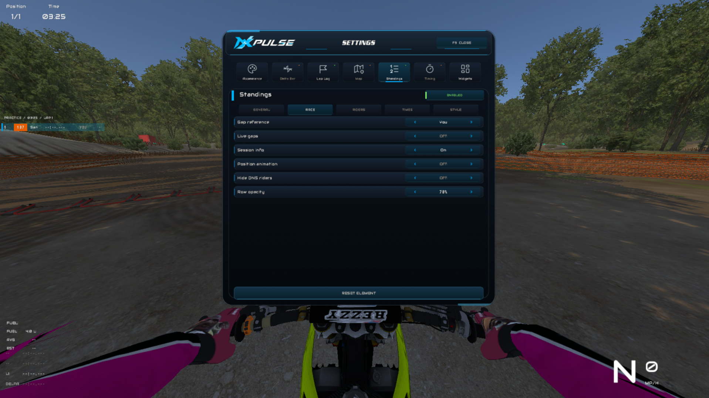

# MXPulse

**Read the race. Find your pace. Feel every second.**

MXPulse is a modern and highly customizable HUD plugin built for **MX Bikes**. It combines live race information, modular widgets and a premium racing-focused interface while keeping the most important information clear and accessible on track.

> **Current release:** Alpha 0.37.3
>
> **Platform:** Windows
>
> **Menu:** F9
>
> **Languages:** English and Brazilian Portuguese

## Download

Download the ZIP package from the latest entry in the repository's **Releases** section. The package contains only the official MXPulse installer.

**[Download MXPulse Alpha 0.37.3](https://github.com/daf0707pro-lgtm/MXPulse/releases/download/v0.37.3-alpha/MXPulse-Alpha-0.37.3.zip)**

The installer automatically detects the MX Bikes folder, installs every required plugin and interface asset, and preserves existing MXPulse positions and preferences when updating.

Windows SmartScreen may display an unknown-publisher warning because the Alpha installer is not currently code-signed.

## Features

- Fully customizable HUD with drag-and-drop positioning
- Independent visibility, scale, opacity and styling controls
- Live standings with rider information, gaps, penalties and status indicators
- Session information for Practice, Qualifying, Warm-up and Race
- Track map with live rider positions, sectors and finish-line markers
- Racing delta bar with live pace comparison
- Lap Log and Timing displays
- Modular widgets for speed, gear, position, lap, session time and fuel
- RPM-aware gear widget with shift and limiter feedback
- Automatic session detection and clean data resets between sessions
- English and Brazilian Portuguese interface
- Persistent layouts and preferences
- Interface designed and tested for larger online servers

## Installation

1. Close MX Bikes.
2. Download the latest ZIP from **Releases**.
3. Extract the ZIP and run the included installer.
4. Confirm the detected MX Bikes installation folder.
5. Launch MX Bikes and press **F9** to open MXPulse.

To update MXPulse, download the newer ZIP and run its installer. Your saved HUD positions and preferences are preserved.

## Project Background

MXPulse began as a personal learning project — a way for me to study plugin development, understand real-time HUD systems, and improve my programming and interface-design skills through practice. It was never created with the intention of competing with, replacing, or taking attention away from any existing project. No source code was copied from any other plugin: MXPulse was independently written from the ground up, with its own architecture, interface, identity, and development direction. I have great respect for the developers and tools that have helped the community grow. What started as a programming exercise gradually evolved into a complete project that I am proud to develop and share with other MX Bikes players.

## Source Code

The MXPulse source code is **not included** in this repository. This repository is used exclusively for official binary releases, public documentation, artwork and issue tracking.

## Alpha Notice

MXPulse is under active development. Features, layouts and settings may continue to evolve. If you find a bug, please report it through the repository's **Issues** section and include the game mode, session type, number of riders and steps needed to reproduce it.

## Disclaimer

MXPulse is an unofficial community-made plugin and is not affiliated with or endorsed by PiBoSo or the MX Bikes developers.
